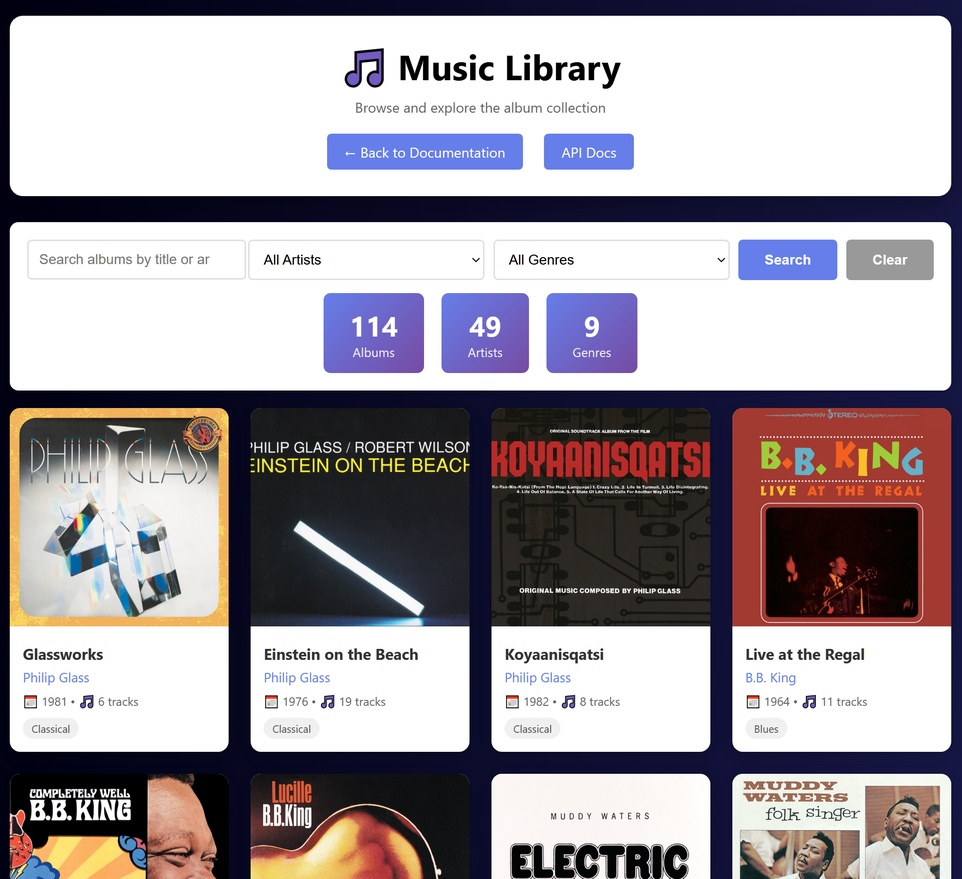

# 🎵 Music Library API

A comprehensive RESTful API for managing a music library built with **Spring Boot 3.5.7** and **MySQL**. This Java application provides full CRUD operations for artists, albums, and genres, with advanced features including pagination, search functionality, album cover images, comprehensive testing, and a Postman sample data import with 50 artists and over 100 albums.

## Accessing the Live Demo

This application runs **on-demand** to minimize AWS costs (~98% savings vs always-on).

**For Employers/Reviewers:**

1. **Visit the launcher:** [https://projectlauncher.jcarl.net](https://projectlauncher.jcarl.net)
2. **Click "Launch Music Library"**
3. The database and application deploy in approximately **5-7 minutes**
4. Use the **direct IP link provided** (DNS for project.jcarl.net may take hours to propagate)

<p align="center">
  
  <br>
  <em>Album browser interface showing search and filtering</em>
</p>

**Why On-Demand?**

| Architecture | Monthly Cost |
|--------------|--------------|
| Always-On (previous) | ~$55/month |
| On-Demand (current) | ~$1/month idle |

This architecture demonstrates real-world **cost optimization** and **serverless thinking** — the same strategies used by companies to reduce cloud spend by 90%+.

**What Happens When You Click Launch:**
1. Lambda function triggers RDS database startup (~2-3 min)
2. Once DB is available, Lambda starts ECS Fargate task (~2-3 min)
3. Container updates DNS record via Namesilo API
4. Status page shows real-time progress and direct IP link
5. After 30 minutes of inactivity, auto-shutdown Lambda stops everything

---

## 📋 Table of Contents

- [Project Overview](#-project-overview)
  - [Key Capabilities](#key-capabilities)
- [Development Approach](#development-approach)
- [On-Demand Architecture](#on-demand-architecture)
- [Technology Stack](#️-technology-stack)
- [Features](#features)
- [Prerequisites](#-prerequisites)
- [Getting Started](#getting-started)
- [API Documentation](#-api-documentation)
- [API Endpoints](#-api-endpoints)
- [Data Models](#-data-models)
- [DTOs (Data Transfer Objects)](#-dtos-data-transfer-objects)
- [Project Structure](#️-project-structure)
- [Configuration](#-configuration)
- [Testing](#-testing)
- [AWS Cloud Deployment](#aws-cloud-deployment)
- [Deployment Journey & Learning Experiences](#deployment-journey--learning-experiences)
- [Cost Management](#-cost-management)
- [Error Handling](#-error-handling)
- [Support](#-support)
- [License](#-license)

---

## 🎵 Project Overview

[](https://spring.io/projects/spring-boot)
[](https://www.oracle.com/java/)
[](https://www.mysql.com/)
[](https://aws.amazon.com/)
[](LICENSE)

The Music Library API is a portfolio-quality Spring Boot application that demonstrates modern backend development and **cloud infrastructure** practices. It provides a complete solution for managing a music catalog with:

- **Artists** - Musicians and bands with biographical information
- **Albums** - Music releases with detailed metadata (release dates, cover art, track counts, catalog numbers)
- **Genres** - Musical categories with many-to-many relationships to albums
- **Relationship Queries** - Find albums by artist or genre
- **Database Management** - Reset functionality for development/testing

### Key Capabilities

✅ Full CRUD operations for all entities  
✅ Search albums by title or artist name  
✅ Pagination and sorting on all list endpoints  
✅ Input validation with detailed error messages  
✅ Automatic timestamp tracking (createdAt, updatedAt)  
✅ OpenAPI 3.0 specification with interactive Swagger UI  
✅ Comprehensive test suite (unit, integration, repository tests)  
✅ Rich music library with 50 artists and 100+ albums  
✅ Album cover image support  
✅ Environment-based configuration  
✅ **On-demand serverless architecture (98% cost reduction)**  
✅ **Auto-shutdown after inactivity**  
✅ **Real-time infrastructure status monitoring**

---

## Development Approach

This project was developed using **AI-assisted development**, with AI tools generating the majority of the code while I focused on project direction, integration, and deployment.

### Project Timeline & Scope

What started as a bootcamp final project became a 400+ hour deep dive into cloud infrastructure:

| Phase | Time Invested | What Happened |
|-------|---------------|---------------|
| Bootcamp project | ~50 hours | Built core API with AI assistance, deployed to Railway |
| AWS migration | ~100 hours | Moved from Railway to AWS ECS/RDS |
| Cost optimization | ~150 hours | Converted from always-on ($55/mo) to on-demand (~$1/mo) |
| Tweaks and improvements | ~100+ hours | UX improvements, monitoring, email notification option for long startup |
| **Total** | **400+ hours** | **110+ builds**, countless debugging sessions |

Most bootcamp students probably completed this assignment in <30 hours by editing previous assignments where the code was provided. I chose to focus on learning AWS and enjoying AI-powered iterative development instead.

### What I Did

**Project Vision & Direction**
- Conceived the project concept and scope
- Made architectural decisions (entities, relationships, features)
- Directed AI tools with specific requirements and constraints

**AWS Deployment & Infrastructure (Hands-On)**
- Deployed to AWS: ECS Fargate, RDS MySQL, ECR, Lambda, API Gateway, EventBridge, S3, CloudFront, SES
- Built serverless launcher with real-time status monitoring
- Implemented auto-shutdown system using CloudWatch metrics
- Debugged real infrastructure issues: ECS circuit breaker rollbacks, DNS automation, IAM permissions
- Solved the dynamic IP problem with Namesilo API integration
- Iterated through 110+ Docker builds and 17+ ECS task revisions

**Cost Optimization (Major Focus)**
- Redesigned architecture from always-on ($55/mo) to on-demand (~$1/mo)
- Eliminated Application Load Balancer ($16+/mo savings)
- Built S3-hosted landing page with Lambda-triggered startup
- Implemented auto-shutdown after 30 minutes of inactivity
- **Achieved 98% cost reduction while maintaining professional UX**

**Integration & Problem-Solving**
- Connected: Spring Boot, MySQL, Lambda, API Gateway, EventBridge, CloudWatch, SES, Namesilo API, S3, CloudFront
- Pivoted from Route 53 to Namesilo when original DNS approach proved too complex
- Calibrated CloudWatch CPU thresholds through production testing
- When things broke, researched solutions and worked with AI to implement fixes

### What AI Did

AI tools (Claude, GPT, and others) generated:
- Most of the Java/Spring Boot code (services, controllers, repositories)
- Test files
- HTML/CSS/JavaScript
- Lambda function code (Python boto3)
- Shell scripts
- This README

### Why This Matters

This project demonstrates:

- **Persistence** — 400+ hours, 110+ builds, mass trial and error
- **Cost consciousness** — Reduced hosting costs by 98% through architectural redesign
- **Real infrastructure skills** — AWS deployment, debugging, multi-service integration
- **Serverless thinking** — On-demand resources, event-driven architecture
- **Effective AI collaboration** — A genuine and growing professional skill
- **Honesty** — I'd rather set accurate expectations than oversell

The bootcamp taught Java basics. The 450+ extra hours taught me how software actually gets deployed, operated, and optimized in the real world.

---

## 🏗️ On-Demand Architecture

The application uses a **serverless-first architecture** that scales to zero when not in use, dramatically reducing costs while maintaining a professional user experience.

### Architecture Diagram

```
┌─────────────────────────────────────────────────────────────────────────┐
│                    ALWAYS-ON LAYER (Pennies/month)                      │
├─────────────────────────────────────────────────────────────────────────┤
│                                                                         │
│   ┌─────────────────────┐         ┌─────────────────────┐               │
│   │  S3 Static Site     │         │  CloudFront + ACM   │               │
│   │  projectlauncher.   │ ──────► │  HTTPS termination  │               │
│   │  jcarl.net          │         │  SSL certificate    │               │
│   └─────────────────────┘         └─────────────────────┘               │
│              │                                                          │
│              ▼                                                          │
│   ┌─────────────────────────────────────────────────────┐               │
│   │              API Gateway + Lambda                    │              │
│   │  ┌─────────────┐  ┌─────────────┐  ┌─────────────┐ │                │
│   │  │ /status     │  │ /start      │  │ Auto-       │ │                │
│   │  │ GET         │  │ POST        │  │ Shutdown    │ │                │
│   │  │ Check state │  │ Start infra │  │ (EventBridge│ │                │
│   │  └─────────────┘  └─────────────┘  │  triggered) │ │                │
│   │                                     └─────────────┘ │               │
│   └─────────────────────────────────────────────────────┘               │
│                                                                         │
└─────────────────────────────────────────────────────────────────────────┘
                              │
                              ▼ (On-Demand Start)
┌─────────────────────────────────────────────────────────────────────────┐
│                    ON-DEMAND LAYER (Pay only when running)              │
├─────────────────────────────────────────────────────────────────────────┤
│                                                                         │
│   ┌─────────────────────┐         ┌─────────────────────┐               │
│   │  RDS MySQL          │         │  ECS Fargate        │               │
│   │  (starts first)     │ ──────► │  (starts when DB    │               │
│   │  ~2-3 min startup   │         │   is available)     │               │
│   └─────────────────────┘         └─────────────────────┘               │
│                                              │                          │
│                                              ▼                          │
│                                   ┌─────────────────────┐               │
│                                   │  Namesilo DNS API   │               │
│                                   │  Updates A record   │               │
│                                   │  project.jcarl.net  │               │
│                                   └─────────────────────┘               │
│                                                                         │
└─────────────────────────────────────────────────────────────────────────┘
                              │
                              ▼ (After 30 min idle)
┌─────────────────────────────────────────────────────────────────────────┐
│                    AUTO-SHUTDOWN FLOW                                   │
├─────────────────────────────────────────────────────────────────────────┤
│                                                                         │
│   EventBridge (every 5 min) ──► Lambda: Check CloudWatch CPU metrics    │
│                                         │                               │
│                                         ▼                               │
│                                   CPU < 2% for 30 min?                  │
│                                         │                               │
│                              ┌──────────┴──────────┐                    │
│                              ▼                     ▼                    │
│                           No: Continue         Yes: Stop ECS + RDS      │
│                                                                         │
└─────────────────────────────────────────────────────────────────────────┘
```

### Startup Sequence

When a user clicks "Launch Music Library":

| Step | Action | Duration |
|------|--------|----------|
| 1 | Lambda receives POST request | <1 sec |
| 2 | Lambda calls `rds.start_db_instance()` | <1 sec |
| 3 | RDS transitions: stopped → starting → available | ~2-3 min |
| 4 | Lambda calls `ecs.update_service(desiredCount=1)` | <1 sec |
| 5 | ECS provisions Fargate task | ~1-2 min |
| 6 | Container runs startup script (DNS update) | ~10 sec |
| 7 | Spring Boot application starts | ~30-60 sec |
| 8 | Health checks pass, app ready | - |
| **Total** | | **~5-7 min** |

### Auto-Shutdown Logic

The auto-shutdown Lambda runs every 5 minutes via EventBridge and:

1. **Queries CloudWatch** for ECS CPU utilization (30-minute average)
2. **Checks threshold**: If average CPU < 1.5%, services are idle
3. **Stops ECS**: Sets desired count to 0
4. **Stops RDS**: Calls `stop_db_instance()`
5. **Logs action**: Records shutdown in CloudWatch Logs

**Why 1.5% threshold?** With 8 vCPUs (db.t4g.2xlarge), Spring Boot idles at ~0.5-1% CPU. The 1.5% threshold ensures we only shut down when truly idle (no requests), not during normal low-activity periods.


### Real-Time Status Monitoring

The status Lambda provides live infrastructure state:

```json
{
  "database_status": "available",
  "application_status": "RUNNING",
  "public_ip": "44.xxx.xxx.xxx",
  "message": "Application is running"
  "startup_time": "X seconds"
}
```

The web UI polls this endpoint every 10 seconds during startup, showing:
- Database: Stopped → Starting → Available
- App: PENDING → PROVISIONING → ACTIVATING → RUNNING
- Progress bar with visual feedback
- Direct IP link (bypasses DNS propagation delays)

---

## 🛠️ Technology Stack

### Core Framework
- **Spring Boot**: 3.5.7
- **Java**: 17
- **Maven**: Build automation and dependency management

### Database & Persistence
- **MySQL**: 8.4 LTS (production on AWS RDS)
- **H2**: In-memory database (testing)
- **Spring Data JPA**: Data access abstraction
- **Hibernate**: ORM implementation

### API & Documentation
- **Spring Web**: RESTful API framework
- **SpringDoc OpenAPI**: 2.8.14 (Swagger UI)
- **Bean Validation (JSR-380)**: Input validation

### Testing
- **JUnit 5**: Testing framework
- **Spring Boot Test**: Integration testing support
- **Mockito**: 5.2.0 (mocking framework with inline support)
- **Testcontainers**: Real MySQL containers for integration tests
- **JaCoCo**: 0.8.12 (code coverage reporting)

### AWS Cloud Services
- **AWS RDS MySQL**: Managed database with on-demand start/stop
- **AWS ECS Fargate**: Serverless container orchestration
- **AWS ECR**: Private Docker container registry
- **AWS Lambda**: Serverless functions (status, startup, auto-shutdown)
- **AWS API Gateway**: REST API endpoints for Lambda functions
- **AWS EventBridge**: Scheduled triggers for auto-shutdown
- **AWS CloudWatch**: Metrics, logs, and monitoring
- **AWS S3**: Static website hosting for launcher
- **AWS CloudFront**: CDN with SSL/TLS termination
- **AWS ACM**: SSL certificate management
- **AWS SES**: Email notifications (DKIM verified)
- **AWS IAM**: Role-based access control and security
- **AWS CodeBuild**: CI/CD pipeline for automated builds

### DNS & Networking
- **Namesilo DNS**: Third-party DNS with API-based automation
- **Dynamic IP Management**: Container-based DNS updates at startup

### Containerization
- **Docker**: Multi-stage builds for optimized images
- **Alpine Linux**: Lightweight container base image

### Utilities
- **Lombok**: Boilerplate code reduction
- **Jackson**: JSON serialization/deserialization

---

## Features

### API Features
- **RESTful Design**: Standard HTTP methods (GET, POST, PUT, DELETE)
- **Search**: Find albums by title or artist name (case-insensitive)
- **Pagination**: All list endpoints support `page`, `size`, and `sort` parameters
- **Relationship Queries**: Get albums by artist or genre
- **Input Validation**: Comprehensive validation with detailed error messages
- **Standardized Errors**: Consistent `ApiError` responses with timestamps and details
- **Automatic Timestamps**: `createdAt` and `updatedAt` tracked automatically
- **Database Reset**: Development endpoint to reset database state

### Technical Features
- **DTO Pattern**: Separate request/response objects for clean API contracts
- **Global Exception Handling**: Centralized error handling with `@ControllerAdvice`
- **Bidirectional Relationships**: Properly managed JPA relationships
- **Lazy Loading**: Optimized database queries with lazy fetching
- **Cascade Operations**: Automatic relationship management
- **Environment Configuration**: YAML-based config with environment variables
- **Comprehensive Testing**: Unit, integration, and repository tests
- **Code Coverage**: JaCoCo reports for test coverage metrics

### Infrastructure Features
- **On-Demand Architecture**: Services start only when needed
- **Auto-Shutdown**: Automatic resource cleanup after 30 minutes idle
- **Real-Time Monitoring**: Live status API for infrastructure state
- **Cost Optimization**: 98% reduction vs always-on architecture
- **Email Notifications**: SES-powered alerts for application lifecycle
- **Dynamic DNS**: Automatic A record updates for ephemeral IPs

---

## 📋 Prerequisites

- **Java 17** or higher installed [Download](https://www.oracle.com/java/technologies/downloads/#java17)
- **MySQL 8.0+** running locally or accessible remotely [Download](https://dev.mysql.com/downloads/mysql/)
- **Maven 3.6+** for building the project [Download](https://maven.apache.org/download.cgi)
- **Git** for version control [Download](https://git-scm.com/downloads)

---

## Getting Started

### 1. Clone the Repository

```bash
git clone https://github.com/jc-gh25/MusicLibrary.git
cd music-library
```

### 2. Database Setup

Create a MySQL database and user:

```sql
CREATE DATABASE music_library;
CREATE USER 'music_user'@'localhost' IDENTIFIED BY 'your_secure_password';
GRANT ALL PRIVILEGES ON music_library.* TO 'music_user'@'localhost';
FLUSH PRIVILEGES;
```

### 3. Configure Environment Variables

The application uses environment variables for database configuration. Set these in your environment or create a `.env` file:

```bash
# Database Configuration
export MYSQL_HOST=localhost
export MYSQL_PORT=3306
export MYSQL_DATABASE=music_library
export MYSQL_USER=music_user
export MYSQL_PASSWORD=your_secure_password

# Server Configuration (optional)
export PORT=8080
```

**Note**: The application uses `src/main/resources/application.yaml` which references these environment variables:

```yaml
spring:
  datasource:
    url: jdbc:mysql://${MYSQL_HOST:localhost}:${MYSQL_PORT:3306}/${MYSQL_DATABASE:music_library}
    username: ${MYSQL_USER:root}
    password: ${MYSQL_PASSWORD:password}
```

See [Configuration](#-configuration) section for complete details.

### 4. Build the Project

```bash
# Clean and compile
mvn clean compile

# Run tests (optional)
mvn test

# Package the application
mvn package
```

### 5. Run the Application

```bash
# Using Maven
mvn spring-boot:run

# Or run the JAR directly
java -jar target/music-library-0.0.1-SNAPSHOT.jar
```

The API will be available at `http://localhost:8080`

### 6. Verify Installation

Visit the API info endpoint:
```bash
curl http://localhost:8080/api
```

Or open Swagger UI in your browser:
```
http://localhost:8080/swagger-ui/index.html
```

### 7. Load Sample Data (Optional)

To populate the database with sample data, use the provided Postman collection:

**Windows:**
```bash
populate-music-library.bat
```

**Linux/Mac:**
```bash
chmod +x populate-music-library.sh
./populate-music-library.sh
```

Or import the Postman collection: `Music-Library-Sample-Data.postman_collection.json`

---

## 📚 API Documentation

Once the application is running, access the interactive API documentation:

- **Swagger UI**: [http://localhost:8080/swagger-ui/index.html](http://localhost:8080/swagger-ui/index.html)
- **OpenAPI JSON**: [http://localhost:8080/v3/api-docs](http://localhost:8080/v3/api-docs)
- **OpenAPI YAML**: [http://localhost:8080/v3/api-docs.yaml](http://localhost:8080/v3/api-docs.yaml)
- **API Info**: [http://localhost:8080/api](http://localhost:8080/api)

The Swagger UI provides:
- Interactive endpoint testing
- Request/response schemas
- Example payloads
- Authentication details (if applicable)

---

## 🎯 API Endpoints

### General

| Method | Endpoint | Description | Status |
|--------|----------|-------------|--------|
| GET | `/api` | API information and available endpoints | 200 |

### Artists

| Method | Endpoint | Description | Status |
|--------|----------|-------------|--------|
| POST | `/api/artists` | Create a new artist | 201 |
| GET | `/api/artists` | Get all artists (paginated) | 200 |
| GET | `/api/artists/{id}` | Get artist by ID | 200 |
| PUT | `/api/artists/{id}` | Update an artist | 200 |
| DELETE | `/api/artists/{id}` | Delete an artist | 204 |
| GET | `/api/artists/{artistId}/albums` | Get all albums by artist | 200 |

### Albums

| Method | Endpoint | Description | Status |
|--------|----------|-------------|--------|
| POST | `/api/albums` | Create a new album | 201 |
| GET | `/api/albums` | Get all albums (paginated) | 200 |
| GET | `/api/albums/search?q={query}` | Search albums by title or artist | 200 |
| GET | `/api/albums/{id}` | Get album by ID | 200 |
| PUT | `/api/albums/{id}` | Update an album | 200 |
| DELETE | `/api/albums/{id}` | Delete an album | 204 |

### Genres

| Method | Endpoint | Description | Status |
|--------|----------|-------------|--------|
| POST | `/api/genres` | Create a new genre | 201 |
| GET | `/api/genres` | Get all genres (paginated) | 200 |
| GET | `/api/genres/{id}` | Get genre by ID | 200 |
| PUT | `/api/genres/{id}` | Update a genre | 200 |
| DELETE | `/api/genres/{id}` | Delete a genre | 204 |
| GET | `/api/genres/{genreId}/albums` | Get all albums by genre | 200 |

### Database Management

| Method | Endpoint | Description | Status |
|--------|----------|-------------|--------|
| DELETE | `/api/reset?confirm=true` | Reset database (requires confirmation) | 200 |

### Query Parameters

All list endpoints support pagination and sorting:

- **`page`** - Page number (zero-based, default: 0)
- **`size`** - Items per page (default: 20)
- **`sort`** - Sort criteria (format: `field,direction`)
  - Examples: `name,asc`, `createdAt,desc`, `title,asc`

**Example Requests:**

```bash
# Search for albums by title or artist name
GET /api/albums/search?q=beatles&page=0&size=20

# Get first page of artists, sorted by name
GET /api/artists?page=0&size=10&sort=name,asc

# Get second page of albums, sorted by release date descending
GET /api/albums?page=1&size=20&sort=releaseDate,desc

# Get all genres, sorted by name
GET /api/genres?sort=name,asc
```

---

## 📊 Data Models

### Artist Entity

Represents a musician or band.

```json
{
  "artistId": 1,
  "name": "The Rolling Stones",
  "description": "Legendary British rock band formed in 1962",
  "createdAt": "2025-01-19T04:40:37",
  "updatedAt": "2025-01-19T04:40:37"
}
```

**Fields:**
- `artistId` (Long) - Auto-generated primary key
- `name` (String, required) - Artist name (max 255 characters)
- `description` (String, optional) - Biographical information (TEXT)
- `createdAt` (LocalDateTime) - Auto-generated creation timestamp
- `updatedAt` (LocalDateTime) - Auto-updated modification timestamp

**Relationships:**
- One-to-Many with Album (cascade all, orphan removal)

---

### Album Entity

Represents a music album with detailed metadata.

```json
{
  "albumId": 1,
  "title": "Abbey Road",
  "releaseDate": "1969-09-26",
  "releaseYear": 1969,
  "coverImageUrl": "https://example.com/covers/abbey-road.jpg",
  "trackCount": 10,
  "catalogNumber": "COC-59100",
  "artist": {
    "artistId": 1,
      "name": "The Beatles"
  },
  "genres": [
    {
      "genreId": 1,
      "name": "Rock"
    }
  ],
  "createdAt": "2025-01-19T04:40:37",
  "updatedAt": "2025-01-19T04:40:37"
}
```

**Fields:**
- `albumId` (Long) - Auto-generated primary key
- `title` (String, required) - Album title (max 255 characters)
- `releaseDate` (LocalDate, optional) - Full release date
- `releaseYear` (Integer, computed) - Derived from releaseDate (transient field)
- `coverImageUrl` (String, optional) - URL to album cover image (max 255 characters)
- `trackCount` (Integer, optional) - Number of tracks on the album
- `catalogNumber` (String, optional) - Unique catalog identifier (max 50 characters)
- `artist` (Artist, required) - Many-to-One relationship with Artist
- `genres` (Set<Genre>, optional) - Many-to-Many relationship with Genre
- `createdAt` (LocalDateTime) - Auto-generated creation timestamp
- `updatedAt` (LocalDateTime) - Auto-updated modification timestamp

**Relationships:**
- Many-to-One with Artist (required)
- Many-to-Many with Genre (via `album_genre` join table)

---

### Genre Entity

Represents a musical genre or category.

```json
{
  "genreId": 1,
  "name": "Rock",
  "description": "Rock music genre characterized by electric guitars and strong rhythms",
  "createdAt": "2025-01-19T04:40:37",
  "updatedAt": "2025-01-19T04:40:37"
}
```

**Fields:**
- `genreId` (Long) - Auto-generated primary key
- `name` (String, required) - Genre name (max 100 characters)
- `description` (String, optional) - Genre description (TEXT)
- `createdAt` (LocalDateTime) - Auto-generated creation timestamp
- `updatedAt` (LocalDateTime) - Auto-updated modification timestamp

**Relationships:**
- Many-to-Many with Album (inverse side, mapped by `genres`)

---

## 📦 DTOs (Data Transfer Objects)

The API uses DTOs to separate internal entity representations from external API contracts.

### CreateArtistRequest

Used for creating new artists.

```json
{
  "name": "The Beatles",
  "description": "Iconic British rock band from Liverpool"
}
```

### CreateAlbumRequest

Used for creating new albums.

```json
{
  "title": "Abbey Road",
  "artistId": 1,
  "genreIds": [1, 2],
  "releaseDate": "1969-09-26",
  "coverImageUrl": "https://example.com/covers/abbey-road.jpg",
  "trackCount": 17,
  "catalogNumber": "PCS-7088"
}
```

### CreateGenreRequest

Used for creating new genres.

```json
{
  "name": "Progressive Rock",
  "description": "Complex rock music with experimental elements"
}
```

### ApiInfoResponse

Returned by `GET /api` endpoint with comprehensive API information.

### DatabaseResetResponse

Returned by `DELETE /api/reset` endpoint with reset statistics.

---

## 🏗️ Project Structure

```
music-library/
├── src/
│   ├── main/
│   │   ├── java/music/library/
│   │   │   ├── MusicLibraryApplication.java    # Main application class
│   │   │   ├── controller/                     # REST controllers
│   │   │   │   ├── MusicLibraryController.java # Main API controller (GET, POST, PUT, DELETE)
│   │   │   │   └── SwaggerRedirectController.java # Swagger UI redirect
│   │   │   ├── entity/                         # JPA entities
│   │   │   │   ├── Artist.java                 # Artist entity with albums relationship
│   │   │   │   ├── Album.java                  # Album entity with artist and genres
│   │   │   │   └── Genre.java                  # Genre entity with albums relationship
│   │   │   ├── repository/                     # Spring Data repositories
│   │   │   │   ├── ArtistRepository.java       # Artist data access
│   │   │   │   ├── AlbumRepository.java        # Album data access
│   │   │   │   └── GenreRepository.java        # Genre data access
│   │   │   ├── service/                        # Business logic layer
│   │   │   │   ├── ArtistService.java          # Artist CRUD operations
│   │   │   │   ├── AlbumService.java           # Album CRUD operations
│   │   │   │   ├── GenreService.java           # Genre CRUD operations
│   │   │   │   └── DatabaseResetService.java   # Database reset functionality
│   │   │   ├── dto/                            # Data Transfer Objects
│   │   │   │   ├── CreateArtistRequest.java    # DTO for creating artists
│   │   │   │   ├── CreateAlbumRequest.java     # DTO for creating albums
│   │   │   │   ├── CreateGenreRequest.java     # DTO for creating genres
│   │   │   │   ├── UpdateArtistRequest.java    # DTO for updating artists (PUT)
│   │   │   │   ├── UpdateAlbumRequest.java     # DTO for updating albums (PUT)
│   │   │   │   ├── UpdateGenreRequest.java     # DTO for updating genres (PUT)
│   │   │   │   ├── ApiInfoResponse.java        # API welcome endpoint response
│   │   │   │   └── DatabaseResetResponse.java  # Database reset response
│   │   │   ├── exception/                      # Exception handling
│   │   │   │   ├── ResourceNotFoundException.java # Custom 404 exception
│   │   │   │   ├── GlobalExceptionHandler.java # Centralized error handling
│   │   │   │   └── ApiError.java               # Standardized error response
│   │   │   ├── config/                         # Configuration classes
│   │   │   │   ├── SwaggerConfig.java          # OpenAPI/Swagger configuration
│   │   │   │   ├── CorsConfig.java             # CORS configuration
│   │   │   │   └── PageConfig.java             # Pagination configuration
│   │   │   └── specification/                  # JPA Specifications
│   │   │       └── AlbumSpecs.java             # Dynamic query specifications
│   │   └── resources/
│   │       ├── application.yaml                # Main configuration
│   │       ├── application-test.yaml           # Test profile configuration
│   │       └── static/                         # Static web resources
│   │           ├── index.html                  # API welcome/launcher page
│   │           ├── library.html                # Music library browser UI
│   │           └── covers/                     # Album cover images directory
│   └── test/
│       └── java/music/library/
│           ├── integration/                    # Integration tests
│           │   ├── ArtistControllerIT.java     # Artist endpoint tests
│           │   ├── AlbumControllerIT.java      # Album endpoint tests (GET, POST)
│           │   ├── AlbumControllerUpdateDeleteIT.java # Album PUT/DELETE tests
│           │   ├── GenreControllerIT.java      # Genre endpoint tests
│           │   └── RestResponsePage.java       # Pagination test helper
│           ├── service/                        # Service layer tests
│           │   ├── ArtistServiceTest.java      # Artist service unit tests
│           │   ├── AlbumServiceTest.java       # Album service unit tests
│           │   └── AlbumServiceBidirectionalTest.java # Relationship tests
│           └── repository/                     # Repository tests
│               └── AlbumRepositoryTest.java    # Album repository tests
├── pom.xml                                     # Maven configuration
├── README.md                                   # This file
├── populate-music-library.bat                  # Windows data loader script
├── populate-music-library.sh                   # Unix/Mac data loader script
├── Dockerfile                                  # Docker containerization config
├── startup.sh                                  # Container startup with DNS update
├── update-namesilo-dns.sh                      # Namesilo API DNS update script
├── docker-compose.yaml                         # Docker Compose configuration
└── Music-Library-Sample-Data.postman_collection.json # Postman API collection
```

### Package Structure

The application follows a standard layered architecture:

- **`music.library`** - Root package
  - **`controller`** - REST API endpoints (presentation layer)
  - **`service`** - Business logic (service layer)
  - **`repository`** - Data access (persistence layer)
  - **`entity`** - JPA entities (domain model)
  - **`dto`** - Data Transfer Objects (API contracts)
  - **`exception`** - Custom exceptions and error handling
  - **`config`** - Spring configuration classes
  - **`specification`** - JPA Specifications for dynamic queries

---

## 🔧 Configuration

### Application Configuration (application.yaml)

The application uses YAML configuration with environment variables for flexibility:

```yaml
# Server Configuration
server:
  port: ${PORT:8080}  # Server port, fallback to 8080 if not specified

# Database Configuration
spring:
  datasource:
    url: jdbc:mysql://${MYSQL_HOST}:${MYSQL_PORT}/${MYSQL_DATABASE}?useSSL=false
    driver-class-name: com.mysql.cj.jdbc.Driver
    username: ${MYSQL_USER}
    password: ${MYSQL_PASSWORD}

  # JPA / Hibernate Configuration
  jpa:
    hibernate:
      ddl-auto: update              # Hibernate manages schema updates
    show-sql: true                  # Print SQL statements (debug)

  # Springdoc / Swagger UI Configuration
  springdoc:
    api-docs:
      path: /v3/api-docs
    swagger-ui:
      enabled: true
      path: /swagger-ui.html

# Prevent Spring from executing plain .sql scripts
sql:
  init:
    mode: never
```

### Environment Variables

Required environment variables:

| Variable | Description | Example |
|----------|-------------|---------|
| `MYSQL_HOST` | MySQL server hostname | `localhost` or RDS endpoint |
| `MYSQL_PORT` | MySQL server port | `3306` |
| `MYSQL_DATABASE` | Database name | `music_library` |
| `MYSQL_USER` | Database username | `music_user` |
| `MYSQL_PASSWORD` | Database password | `your_secure_password` |
| `PORT` | Server port (optional) | `8080` |
| `NAMESILO_API_KEY` | DNS update API key (ECS only) | `your_api_key` |

### Test Configuration (application-test.yaml)

Tests use an H2 in-memory database for fast, isolated testing:

```yaml
spring:
  datasource:
    url: jdbc:h2:mem:testdb
    driver-class-name: org.h2.Driver
  jpa:
    hibernate:
      ddl-auto: create-drop
```

---

## 🧪 Testing

The application includes a comprehensive test suite covering multiple layers.

### Test Structure

```
src/test/java/music/library/
├── integration/              # Full stack integration tests
│   ├── ArtistControllerIT.java
│   ├── AlbumControllerIT.java
│   ├── AlbumControllerUpdateDeleteIT.java
│   └── GenreControllerIT.java
├── service/                  # Service layer unit tests
│   ├── ArtistServiceTest.java
│   ├── AlbumServiceTest.java
│   └── AlbumServiceBidirectionalTest.java
└── repository/               # Repository layer tests
    └── AlbumRepositoryTest.java
```

### Test Types

#### 1. Integration Tests (`*IT.java`)

Full-stack tests using `@SpringBootTest` and `MockMvc`:

- Test complete request/response cycle
- Use H2 in-memory database
- Verify HTTP status codes, headers, and response bodies
- Test pagination, sorting, and filtering
- Validate error handling and edge cases

**Example:**
```java
@SpringBootTest
@AutoConfigureMockMvc
@TestInstance(TestInstance.Lifecycle.PER_CLASS)
class ArtistControllerIT {
    @Autowired
    private MockMvc mockMvc;
    
    @Test
    void testCreateArtist() throws Exception {
        mockMvc.perform(post("/api/artists")
            .contentType(MediaType.APPLICATION_JSON)
            .content("{\"name\":\"The Beatles\"}"))
            .andExpect(status().isCreated())
            .andExpect(jsonPath("$.name").value("The Beatles"));
    }
}
```

#### 2. Service Tests (`*Test.java`)

Unit tests for business logic using Mockito:

- Mock repository dependencies
- Test service methods in isolation
- Verify exception handling
- Test bidirectional relationship management

**Example:**
```java
@ExtendWith(MockitoExtension.class)
class ArtistServiceTest {
    @Mock
    private ArtistRepository artistRepository;
    
    @InjectMocks
    private ArtistService artistService;
    
    @Test
    void testFindById_Success() {
        Artist artist = new Artist();
        artist.setArtistId(1L);
        when(artistRepository.findById(1L)).thenReturn(Optional.of(artist));
        
        Artist result = artistService.findById(1L);
        
        assertNotNull(result);
        assertEquals(1L, result.getArtistId());
    }
}
```

#### 3. Repository Tests

Tests for custom repository queries and JPA behavior:

- Test custom query methods
- Verify relationship mappings
- Test cascade operations

### Running Tests

```bash
# Run all tests
mvn test

# Run specific test class
mvn test -Dtest=ArtistControllerIT

# Run tests with coverage report
mvn verify

# View test results
# Individual test results are in target/surefire-reports/
```

### Test Results

Test execution results are generated by **Maven Surefire**:

- Test reports generated in `target/surefire-reports/`
- XML and text reports for each test class
- Console output shows test pass/fail summary

### Test Best Practices

✅ Use `@TestInstance(PER_CLASS)` for efficient test data reuse  
✅ Clean up test data in `@AfterEach` or `@AfterAll` methods  
✅ Use meaningful test names (e.g., `testCreateArtist_WithValidData_ReturnsCreated`)  
✅ Test both success and failure scenarios  
✅ Verify exception messages and error responses  
✅ Use `@Transactional` for tests that modify data  

---

## ☁️ AWS Cloud Deployment

The application is deployed on **Amazon Web Services (AWS)** using a modern, cost-optimized architecture that combines always-on serverless components with on-demand compute resources.

**Live Production API**: [http://project.jcarl.net/api](http://project.jcarl.net/api)  
**Launcher Page**: [https://projectlauncher.jcarl.net](https://projectlauncher.jcarl.net)  
**Custom Domain**: `project.jcarl.net` (via Namesilo DNS with API-based auto-update)

### AWS Services Used

| Service | Purpose | Always-On? |
|---------|---------|------------|
| **S3** | Static website hosting (launcher) | ✅ Yes (pennies/mo) |
| **CloudFront** | CDN + SSL termination | ✅ Yes (pennies/mo) |
| **ACM** | SSL certificate | ✅ Yes (free) |
| **API Gateway** | REST endpoints for Lambda | ✅ Yes (pennies/mo) |
| **Lambda** | Status check, startup, auto-shutdown | ✅ Yes (pennies/mo) |
| **EventBridge** | Scheduled auto-shutdown trigger | ✅ Yes (free) |
| **CloudWatch** | Metrics, logs, monitoring | ✅ Yes (minimal) |
| **SES** | Email notifications | ✅ Yes (pennies/mo) |
| **RDS MySQL** | Production database | ❌ On-demand |
| **ECS Fargate** | Container orchestration | ❌ On-demand |
| **ECR** | Docker image registry | ✅ Yes (minimal) |
| **IAM** | Access control | ✅ Yes (free) |

### Lambda Functions

Three Lambda functions power the on-demand architecture:

#### 1. Status Lambda (`/status` endpoint)
```python
# Queries ECS and RDS to return current infrastructure state
{
  "database_status": "available",      # RDS status
  "application_status": "RUNNING",     # ECS task status
  "public_ip": "44.xxx.xxx.xxx",       # Fargate task public IP
  "message": "Application is running"
}
```

**Key features:**
- Extracts public IP from ECS task ENI attachments
- Handles various RDS states (stopped, starting, available, configuring-enhanced-monitoring)
- Returns actionable status for frontend UI

#### 2. Startup Lambda (`/start` endpoint)
```python
# Orchestrates the startup sequence
1. Start RDS instance (rds.start_db_instance())
2. Wait for RDS to become available
3. Start ECS service (ecs.update_service(desiredCount=1))
4. Optionally trigger email notification via SES
```

**Key features:**
- Handles idempotency (safe to call multiple times)
- Coordinates timing between RDS and ECS
- Self-invocation pattern for long-running operations

#### 3. Auto-Shutdown Lambda (EventBridge triggered)
```python
# Runs every 5 minutes via EventBridge
1. Query CloudWatch for ECS CPU metrics (30-min average)
2. If CPU < 2%: services are idle
3. Stop ECS service (desiredCount=0)
4. Stop RDS instance
5. Log shutdown action
```

**Key features:**
- CloudWatch metrics analysis for idle detection
- Startup protection (won't shutdown during boot)
- 2% CPU threshold calibrated through production testing
- 30-second Lambda timeout to accommodate CloudWatch API calls

### RDS MySQL Configuration

**Current Instance**: Optimizing for cold-start performance

| Setting | Value |
|---------|-------|
| Engine | MySQL 8.4 LTS |
| Storage | 20 GB gp2 |
| Endpoint | `music-library-db.cv4kawuomqo5.us-west-2.rds.amazonaws.com` |
| Security | VPC security group, ECS access only |

**Database Evolution:**
```
db.t3.micro → db.t4g.micro (Graviton2, 20% faster)
                    ↓
         Currently testing larger instances
         for faster cold-start times
```

### ECS Fargate Configuration

| Setting | Value |
|---------|-------|
| Cluster | `music-library-cluster1` |
| Service | `music-library-service` |
| Task CPU | 256 (0.25 vCPU) |
| Task Memory | 512 MB |
| Launch Type | FARGATE |
| Network | awsvpc with public IP |

### Docker Containerization

The application uses a **multi-stage Docker build** optimized for size and includes DNS automation:

```dockerfile
# Stage 1: Build with Maven
FROM maven:3.9-eclipse-temurin-17 AS build
WORKDIR /app
COPY pom.xml .
COPY src ./src
RUN mvn clean package -DskipTests

# Stage 2: Runtime with DNS automation
FROM eclipse-temurin:17-jre-alpine
WORKDIR /app

# Install curl and jq for DNS updates
RUN apk add --no-cache curl jq

# Copy DNS update scripts
COPY update-namesilo-dns.sh /update-namesilo-dns.sh
COPY startup.sh /startup.sh
RUN chmod +x /update-namesilo-dns.sh /startup.sh

COPY --from=build /app/target/*.jar app.jar
EXPOSE 8080
ENTRYPOINT ["/startup.sh"]
```

### Solving the Dynamic IP Challenge

**Problem**: AWS ECS Fargate assigns dynamic public IP addresses that change whenever tasks restart.

**Solution**: Container-based automated DNS management:

1. **Container startup** runs `startup.sh`
2. **IP Detection** uses ECS Task Metadata Endpoint V4 to get public IP
3. **DNS Update** calls Namesilo API to update A record
4. **Application starts** after DNS is updated

```bash
# Container detects its own IP and updates Namesilo DNS
TASK_METADATA=$(curl -s $ECS_CONTAINER_METADATA_URI_V4/task)
PUBLIC_IP=$(echo $TASK_METADATA | jq -r '.Containers[0].Networks[0].IPv4Addresses[0]')

# Update Namesilo DNS record via API
curl "https://www.namesilo.com/api/dnsUpdateRecord?version=1&type=xml&key=${NAMESILO_API_KEY}&domain=jcarl.net&rrid=<record-id>&rrhost=project&rrvalue=${PUBLIC_IP}&rrttl=7207"
```

**Benefits**:
- ✅ Consistent API endpoint regardless of infrastructure changes
- ✅ Self-contained solution - no external Lambda required for DNS
- ✅ Updates DNS within seconds of container startup
- ✅ Fully automated - no manual intervention
- ✅ Direct IP provided to users (bypasses DNS propagation)

### Deployment Validation

The AWS deployment was thoroughly tested using Postman:
- **182 API requests** executed successfully
- **600 tests** passed (100% pass rate)
- All CRUD operations validated
- Relationship queries verified
- Performance metrics collected

---

## 🛤️ Deployment Journey & Learning Experiences

This section documents the real-world challenges, solutions, and learning experiences encountered during the AWS deployment and cost optimization process. It demonstrates problem-solving skills, adaptability, and persistence in overcoming infrastructure obstacles.

### Overview

The deployment journey involved multiple iterations, technology pivots, and creative problem-solving. What started as a simple "deploy to AWS" goal evolved into a comprehensive cost optimization project that reduced monthly costs by 98%.

**Final Architecture**:
- **Domain**: `project.jcarl.net` (app) + `projectlauncher.jcarl.net` (launcher)
- **Build Count**: 110+ Docker builds
- **Task Revisions**: 17+ ECS task definition updates
- **DNS Provider**: Namesilo (migrated from Route 53)
- **Build Environment**: AWS CloudShell (due to Windows LTSB Docker incompatibility)

---

### Challenge 1: Route 53 DNS Automation Attempts

**Initial Approach**: Automate DNS updates using AWS Route 53 with container startup scripts.

**Problems Encountered**:

1. **Bash Heredoc Syntax Errors in Alpine Linux**
   - Alpine Linux uses `ash` shell, not `bash`
   - Heredoc syntax in Route 53 update scripts failed with parsing errors
   - Bash-specific features not available in ash shell

2. **JSON Formatting Challenges**
   - Route 53 API requires complex nested JSON structures
   - JSON escaping errors in shell scripts
   - Overly complex for container startup automation

**Outcome**: Pivoted away from Route 53 to simpler solution.

**Learning**: Shell compatibility matters when choosing base images. Alpine's ash shell has limitations compared to bash.

---

### Challenge 2: IAM Permission Issues

**Problem**: ECS tasks failed to register new task definitions due to insufficient IAM permissions.

**Error**:
```
AccessDeniedException: User is not authorized to perform: ecs:RegisterTaskDefinition
```

**Investigation**:
- Task execution role vs task role distinction was unclear
- Route 53 permissions were added to wrong role
- ECS permissions were missing entirely

**Solution**: Properly configured separate roles for task execution (infrastructure) vs task role (application permissions).

**Learning**: AWS IAM has distinct roles for different purposes. Understanding this distinction is critical for ECS deployments.

---

### Challenge 3: ECS Circuit Breaker and Task Rollbacks

**Problem**: ECS service repeatedly rolled back from new task revisions (4, 5, 6) to revision 2.

**Symptoms**:
- Tasks would start (PROVISIONING → PENDING → RUNNING)
- Health checks would fail
- Circuit breaker triggered automatic rollback

**Root Causes Identified**:
1. DNS update script failures causing container startup delays
2. Health check timeouts during script execution
3. Shell compatibility issues (ash vs bash)
4. Missing dependencies in Alpine Linux

**Outcome**: Circuit breaker continued triggering. Decision made to simplify DNS approach.

**Learning**: ECS circuit breaker is protective. When tasks repeatedly fail, it's better to simplify than fight the system.

---

### Challenge 4: Windows LTSB Docker Incompatibility

**Problem**: Local Windows LTSB system incompatible with Docker Desktop.

**Impact**:
- Couldn't test Dockerfile changes locally
- Slow feedback loop (had to deploy to test)
- Difficult to debug container startup issues

**Solution**: **AWS CloudShell**
- Cloud-based Linux environment with Docker pre-installed
- Direct access to AWS services (ECR, ECS)
- No local Docker installation required

**Learning**: Cloud-based development environments can overcome local system limitations.

---

### Challenge 5: Migration to Namesilo DNS

**Decision Point**: After multiple failed Route 53 attempts, migrated to Namesilo DNS API.

**Reasons for Migration**:
1. **Simpler API**: HTTP GET requests vs Route 53's complex JSON
2. **No IAM Required**: API key authentication
3. **Shell-Friendly**: Single curl command
4. **Proven Reliability**: Stable third-party API

**Results**:
- Task deployments became stable
- DNS updates work reliably on container startup
- No more circuit breaker rollbacks

**Learning**: Sometimes the best solution is the simplest one. Third-party APIs can be more reliable than complex AWS service integrations.

---

### Challenge 6: Static File Serving After Spring Boot Update

**Problem**: After Spring Boot/Swagger configuration updates, static HTML files returned "No endpoint GET" errors on AWS ECS.

**Root Cause**: Spring Boot version changes disabled default static resource serving.

**Solution**: Added environment variable to ECS task definition:
```
SPRING_WEB_RESOURCES_STATIC_LOCATIONS=classpath:/static/,classpath:/public/
```

**Learning**: Environment-specific configuration differences between local and AWS deployment require careful attention.

---

### Challenge 7: API Pagination & Swagger Integration

**Problem**: 500 errors in REST API endpoints caused by Swagger UI parameter conflicts.

**Root Cause**: Swagger UI injected default `sort=string` parameters that overrode Spring's `@PageableDefault` annotations, causing "No property 'string' found" errors.

**Solution**:
- Migrated from implicit Pageable parameters to explicit `@RequestParam` declarations
- Standardized pagination across all endpoints
- Updated OpenAPI documentation to match actual parameters

**Learning**: API documentation tools can introduce unexpected behavior. Test endpoints through Swagger UI, not just direct calls.

---

### Challenge 8: Cost Optimization - From $55/mo to $1/mo

**Problem**: Always-on architecture cost ~$55/month for a portfolio project with minimal traffic.

**Cost Breakdown (Before)**:
| Service | Monthly Cost |
|---------|--------------|
| RDS (db.t3.micro, 24/7) | ~$13 |
| ECS Fargate (24/7) | ~$36 |
| ALB | ~$16 |
| Other | ~$5 |
| **Total** | **~$55-70** |

**Solution**: Complete architecture redesign:

1. **Eliminated ALB** - Direct IP access + DNS automation
2. **On-Demand ECS** - Runs only when launched
3. **On-Demand RDS** - Starts with application
4. **S3 Static Launcher** - Always-on landing page (pennies/month)
5. **Lambda Functions** - Serverless status/startup/shutdown
6. **Auto-Shutdown** - Stops everything after 30 min idle

**Cost Breakdown (After)**:
| Service | Monthly Cost |
|---------|--------------|
| S3 + CloudFront | ~$0.10 |
| Lambda + API Gateway | ~$0.10 |
| RDS (when running) | ~$0.02/hour |
| ECS (when running) | ~$0.05/hour |
| **Idle Total** | **~$0.50-1.00** |

**Learning**: Serverless-first thinking can dramatically reduce costs for low-traffic applications.

---

### Challenge 9: Lambda Auto-Shutdown Implementation

**Problem**: Needed automatic resource cleanup to prevent cost accumulation.

**Initial Approach**: Simple timer-based shutdown.

**Problems**:
- Couldn't distinguish between "idle" and "low activity"
- Risk of shutting down during legitimate use
- Spring Boot idles at ~10-12% CPU, not 0%

**Solution**: CloudWatch metrics-based idle detection:
1. Query ECS CPU utilization via CloudWatch API
2. Calculate 30-minute rolling average
3. Shutdown only if CPU < 2% (truly idle, no requests)
4. Added startup protection to prevent shutdown during boot

**Technical Details**:
- Lambda timeout: 30 seconds (needed for CloudWatch API calls)
- EventBridge trigger: Every 5 minutes
- CPU threshold: 2% (calibrated through production testing)
- Initial threshold of 35% was too aggressive (shut down active app)

**Learning**: Idle detection requires careful threshold calibration. Production testing is essential.

---

### Challenge 10: Real-Time Status Monitoring

**Problem**: Users needed feedback during 5-7 minute startup sequence.

**Solution**: Built Lambda-based status API that queries live infrastructure state:

1. **ECS Status**: PENDING → PROVISIONING → ACTIVATING → RUNNING
2. **RDS Status**: stopped → starting → available
3. **Public IP Extraction**: Query ENI attachments from Fargate task
4. **Progress UI**: Frontend polls every 10 seconds with visual progress bar

**Challenges Solved**:
- Extracting public IP from Fargate task (requires EC2 network interface permissions)
- Handling various RDS states (including `configuring-enhanced-monitoring`)
- CORS configuration for cross-origin API calls
- Direct IP link to bypass DNS propagation delays

**Learning**: Good UX requires visibility into system state. Real-time feedback transforms a frustrating wait into an engaging experience.

---

### Challenge 11: Email Notifications with SES

**Problem**: Wanted to notify users when application was ready.

**Implementation**:
1. Configured Amazon SES with domain verification (jcarl.net)
2. Set up DKIM authentication for deliverability
3. Requested and received SES production access
4. Integrated notifications into startup Lambda

**Challenge**: Lambda timeout during email delay
- Needed 5-minute delay before sending "app ready" email
- Standard Lambda timeout is 15 minutes max
- Solution: Self-invocation pattern for async delay

**Learning**: SES production access requires proper use case documentation. Async patterns needed for long delays in Lambda.

---

### Challenge 12: Database Performance & Cold Start Optimization

**Problem**: RDS cold start times affecting user experience.

**Evolution**:
```
db.t3.micro (original)
    ↓
db.t4g.micro (Graviton2, 20% faster, same cost)
    ↓
Testing larger instances for faster cold boot
```

**Observations**:
- MySQL 8.0.43 → 8.4.7 LTS upgrade for security/performance
- Graviton2 (ARM) provides better price/performance
- Larger instances have faster cold start but higher per-hour cost
- Trade-off: faster startup vs cost when running

**Current Status**: Actively optimizing instance size for best cold-start performance within budget.

**Learning**: Database cold start is a real consideration for on-demand architectures. Instance sizing affects both performance and cost.

---

### Key Takeaways

**Problem-Solving**:
- ✅ Diagnosed complex multi-layer issues (shell compatibility, IAM, health checks)
- ✅ Pivoted strategies when initial approaches failed
- ✅ Made data-driven decisions based on production metrics

**Technical Skills**:
- ✅ Shell scripting and container debugging
- ✅ Docker multi-stage builds
- ✅ AWS service integration (ECS, RDS, Lambda, API Gateway, CloudWatch, SES)
- ✅ IAM role and policy configuration
- ✅ DNS automation with third-party APIs
- ✅ CloudWatch metrics analysis

**DevOps Practices**:
- ✅ Infrastructure as code thinking
- ✅ Cost optimization strategies
- ✅ Automated monitoring and alerting
- ✅ Production debugging and troubleshooting

**Adaptability**:
- ✅ Overcame local environment limitations
- ✅ Migrated DNS providers mid-project
- ✅ Simplified architecture when complexity became a liability
- ✅ Learned from failures and adjusted approach

---

## 💰 Cost Management

Understanding and managing AWS costs was a **primary focus** of this project. The architecture was specifically designed to minimize costs while maintaining professional presentation for portfolio demonstrations.

### Cost Comparison

| Architecture | Monthly Cost | Notes |
|--------------|--------------|-------|
| **Always-On (Original)** | ~$55-70 | ECS + RDS + ALB running 24/7 |
| **On-Demand (Current)** | ~$0.50-1.00 idle | Pay only when running |
| **Savings** | **98%** | Same functionality, fraction of cost |

### Detailed Cost Breakdown

#### Always-On Costs (Before)

| Service | Hourly | Monthly | Notes |
|---------|--------|---------|-------|
| RDS db.t3.micro | $0.017 | ~$13 | 24/7 database |
| ECS Fargate | $0.05 | ~$36 | 24/7 container |
| Application Load Balancer | - | ~$16 | Base + LCU charges |
| Data Transfer | - | ~$5 | Variable |
| **Total** | - | **~$55-70** | - |

#### On-Demand Costs (After)

**Always-On Components** (pennies/month):
| Service | Monthly Cost |
|---------|--------------|
| S3 Static Hosting | ~$0.02 |
| CloudFront | ~$0.05 |
| API Gateway | ~$0.03 |
| Lambda | ~$0.01 |
| CloudWatch | ~$0.05 |
| **Subtotal** | **~$0.15-0.20** |

**On-Demand Components** (only when running):
| Service | Hourly Cost | If running 10 hrs/month |
|---------|-------------|-------------------------|
| RDS | ~$0.02 | ~$0.20 |
| ECS Fargate | ~$0.05 | ~$0.50 |
| **Subtotal** | - | **~$0.70** |

**Realistic Monthly Total**: ~$1-5 depending on usage

### Cost Optimization Strategies Used

1. **Eliminated ALB** ($16+/month savings)
   - Direct IP access to Fargate task
   - DNS automation handles dynamic IPs
   - Trade-off: No HTTPS on app (acceptable for portfolio)

2. **On-Demand Compute**
   - ECS service scales to 0 when not needed
   - RDS stops after inactivity
   - Lambda handles startup orchestration

3. **Serverless-First Architecture**
   - S3 for static hosting (vs EC2)
   - Lambda for logic (vs always-on server)
   - API Gateway for endpoints (vs custom server)

4. **Auto-Shutdown System**
   - EventBridge triggers Lambda every 5 minutes
   - CloudWatch metrics detect idle state
   - Automatic cleanup prevents cost accumulation

5. **Right-Sizing Resources**
   - Fargate: 0.25 vCPU, 512MB (minimum viable)
   - RDS: Optimizing instance size for cold-start vs cost

### Starting and Stopping Resources

#### Automatic (Recommended)
- **Start**: Click "Launch Music Library" on [projectlauncher.jcarl.net](https://projectlauncher.jcarl.net)
- **Stop**: Automatic after 30 minutes of inactivity

#### Manual via AWS Console

**Stop ECS Service**:
1. Navigate to ECS Console → Clusters → `music-library-cluster1`
2. Select service → Update → Set desired tasks to `0`

**Stop RDS Database**:
1. Navigate to RDS Console → Databases → `music-library-db`
2. Actions → Stop temporarily

**Note**: RDS can only be stopped for 7 days. AWS automatically restarts it after 7 days.

#### Manual via AWS CLI

```bash
# Stop ECS service
aws ecs update-service \
  --cluster music-library-cluster1 \
  --service music-library-service \
  --desired-count 0 \
  --region us-west-2

# Stop RDS database
aws rds stop-db-instance \
  --db-instance-identifier music-library-db \
  --region us-west-2

# Start RDS database
aws rds start-db-instance \
  --db-instance-identifier music-library-db \
  --region us-west-2

# Start ECS service
aws ecs update-service \
  --cluster music-library-cluster1 \
  --service music-library-service \
  --desired-count 1 \
  --region us-west-2
```

---

## 🚨 Error Handling

The API uses a global exception handler (`@ControllerAdvice`) for consistent error responses.

### Standard Error Response

All errors return an `ApiError` object:

```json
{
  "timestamp": "2025-01-19T10:30:45",
  "status": 404,
  "error": "Not Found",
  "message": "Artist not found with id: 999",
  "path": "/api/artists/999"
}
```

### HTTP Status Codes

| Status Code | Description | Example |
|-------------|-------------|---------|
| **200 OK** | Successful GET/PUT request | Artist retrieved successfully |
| **201 Created** | Successful POST request | Artist created successfully |
| **204 No Content** | Successful DELETE request | Artist deleted successfully |
| **400 Bad Request** | Invalid input data | Missing required field |
| **404 Not Found** | Resource not found | Artist with ID 999 not found |
| **500 Internal Server Error** | Server error | Database connection failed |

### Validation Errors

Input validation errors return detailed field-level errors:

```json
{
  "timestamp": "2025-01-19T10:30:45",
  "status": 400,
  "error": "Bad Request",
  "message": "Validation failed",
  "errors": {
    "name": "Artist name must not be blank",
    "description": "Description must be ≤ 1000 characters"
  },
  "path": "/api/artists"
}
```

### Exception Types

- **`ResourceNotFoundException`** - Entity not found (404)
- **`MethodArgumentNotValidException`** - Validation failure (400)
- **`HttpMessageNotReadableException`** - Malformed JSON (400)
- **`DataIntegrityViolationException`** - Database constraint violation (400)
- **`Exception`** - Generic server error (500)

---

## 🎓 Learning Outcomes

This project demonstrates proficiency in:

### Backend Development
✅ **Spring Boot 3.x** - Modern Spring framework features  
✅ **RESTful API Design** - Standard HTTP methods and status codes  
✅ **JPA/Hibernate** - Entity relationships and lazy loading  
✅ **Testing** - Unit, integration, and repository tests  
✅ **API Documentation** - OpenAPI/Swagger specification  
✅ **Error Handling** - Global exception handling  
✅ **Input Validation** - Bean Validation (JSR-380)  
✅ **DTO Pattern** - Separation of concerns  

### AWS Cloud & DevOps
✅ **ECS Fargate** - Serverless container orchestration  
✅ **RDS MySQL** - Managed database with start/stop automation  
✅ **Lambda** - Serverless functions for infrastructure automation  
✅ **API Gateway** - REST API for Lambda integration  
✅ **EventBridge** - Scheduled triggers for auto-shutdown  
✅ **CloudWatch** - Metrics analysis and monitoring  
✅ **S3 + CloudFront** - Static website hosting with CDN  
✅ **SES** - Email notifications with domain verification  
✅ **IAM** - Role-based access control and security policies  
✅ **ECR** - Private Docker container registry  
✅ **CodeBuild** - CI/CD pipeline automation  

### Cost Optimization
✅ **Serverless-First Architecture** - On-demand resources  
✅ **Auto-Shutdown Systems** - CloudWatch metrics-based idle detection  
✅ **Resource Right-Sizing** - Balancing performance vs cost  
✅ **ALB Elimination** - Direct IP access with DNS automation  
✅ **98% Cost Reduction** - From $55/mo to ~$1/mo  

### Infrastructure & DevOps Practices
✅ **Docker Containerization** - Multi-stage builds  
✅ **DNS Automation** - Third-party API integration  
✅ **Real-Time Monitoring** - Infrastructure status dashboards  
✅ **Production Debugging** - ECS circuit breaker, IAM permissions  
✅ **Environment Configuration** - YAML with environment variables  

---

## 📈 Project Metrics

| Metric | Value |
|--------|-------|
| **Docker Builds** | 110+ |
| **ECS Task Revisions** | 17+ |
| **Development Hours** | 400+ |
| **Cost Reduction** | 98% ($55 → $1/mo) |
| **API Requests Tested** | 182 |
| **Automated Tests** | 600 (100% pass rate) |
| **Artists in Library** | 50 |
| **Albums in Library** | 100+ |

---

## 📝 License

This project is part of a Java/MySQL backend development bootcamp and is for **educational purposes**.

---

## ❓ Support

For questions, issues, or feedback:

1. **Check the API documentation**: [Swagger UI](http://project.jcarl.net/swagger-ui/index.html) (when app is running)
2. **Review test examples**: See `src/test/java/music/library/`
3. **Check Postman collection**: `Music-Library-Sample-Data.postman_collection.json`
4. **Launch the app**: [projectlauncher.jcarl.net](https://projectlauncher.jcarl.net)

---

## 🙏 Acknowledgments

My thanks to:
- **Prashant H.** - Bootcamp Instructor
- **Michael G.** - Bootcamp Mentor
- **Tammy E.** - Career Services Manager
- **Tiffany H.** - Career Advisor